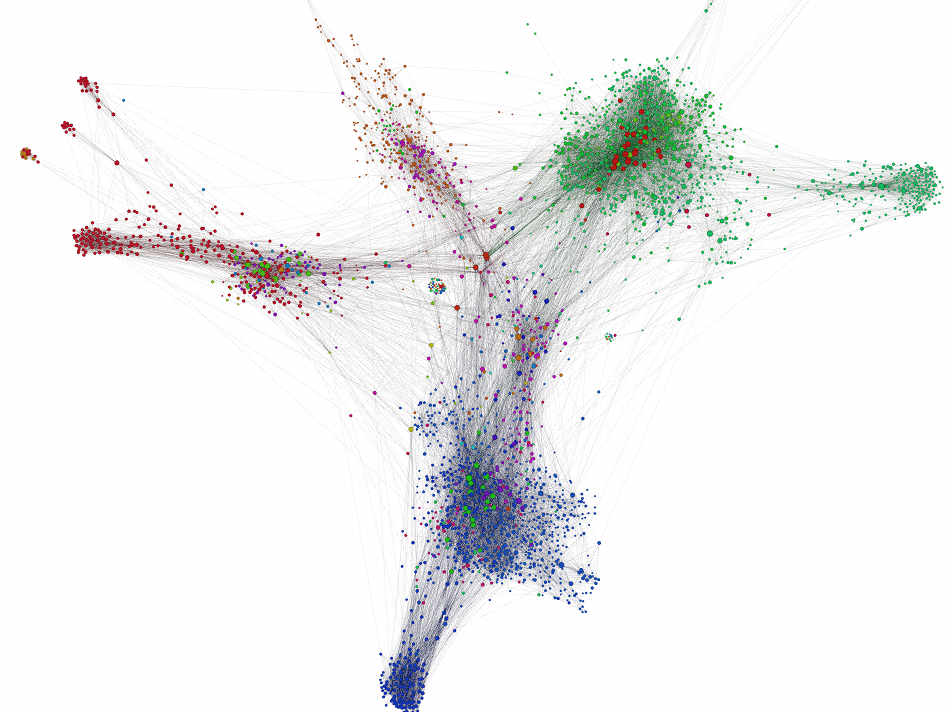
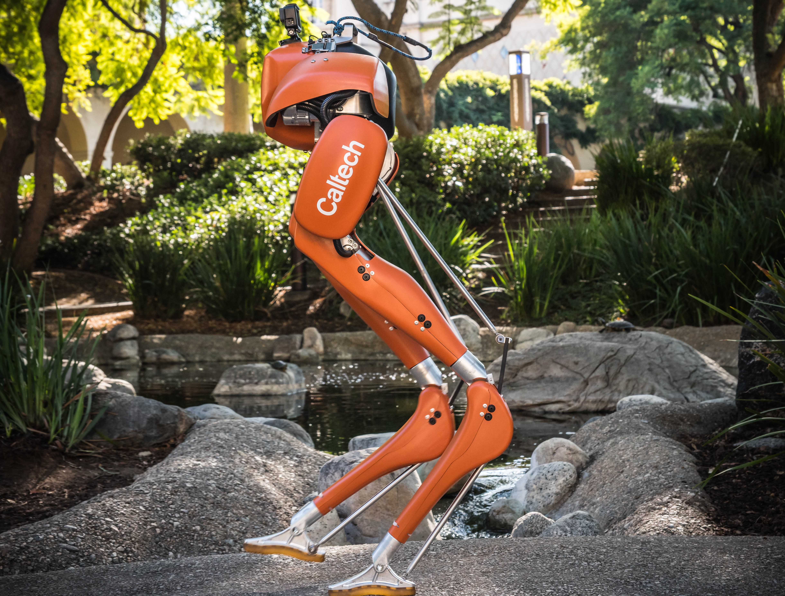
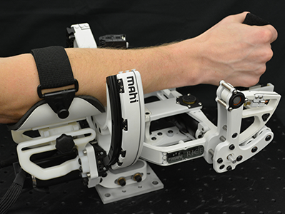

<!DOCTYPE html>
<html>
<title>Claudia Kann</title>
<meta charset="UTF-8">
<meta name="viewport" content="width=device-width, initial-scale=1">
<link rel="stylesheet" href="personalstyle.css">
<body>

<!-- Navbar (sit on top) -->

  

    <a href="index.md" class="w3-bar-item w3-button"> Claudia Kann</a>
    <!-- Float links to the right. Hide them on small screens -->
    

      <a href="projects.md" class="w3-bar-item w3-button">Projects</a>
      <a href="about.md" class="w3-bar-item w3-button">About</a>
      <a href="CV.md" class="w3-bar-item w3-button">CV</a>
      <a href="contact.md" class="w3-bar-item w3-button">Contact</a>
    

  

<!-- Header -->
<header class="w3-display-container w3-content w3-wide" style="max-width:1500px;" id="home">
  
  

    <h1 class="w3-xxlarge w3-text-white"><b>Claudia Kann</b> </h1>
  

</header>

<!-- Page content -->

  <!-- Project Section -->
  

    <h3 class="w3-border-bottom w3-border-light-grey w3-padding-16">Projects</h3>
  

  

    

      

        
Protest Movements

        
      

    

    

      

        
Monitoring the Election

        
      

    

    

      

        
Hidden Donors

        
      

    

  

  

    

      

        
Cassie

        
      

    

    

      

        
Atalante

        
      

    

      

      

        
MAHI Lab

        
      

    

  

  
  
<!-- End page content -->

<!-- Footer -->
<footer class="w3-center w3-black w3-padding-16">
  
Powered by <a href="https://www.w3schools.com/w3css/default.asp" title="W3.CSS" target="_blank" class="w3-hover-text-green">w3.css</a>

</footer>

</body>
</html>

